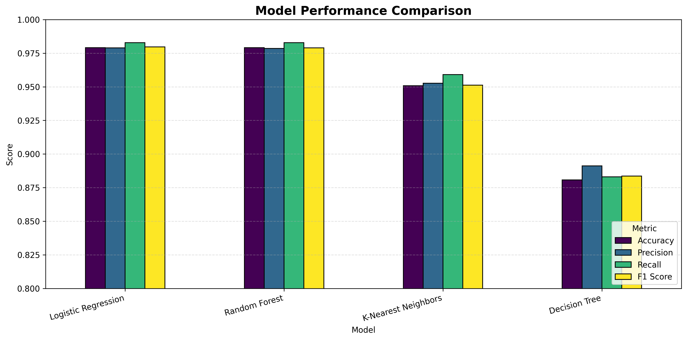
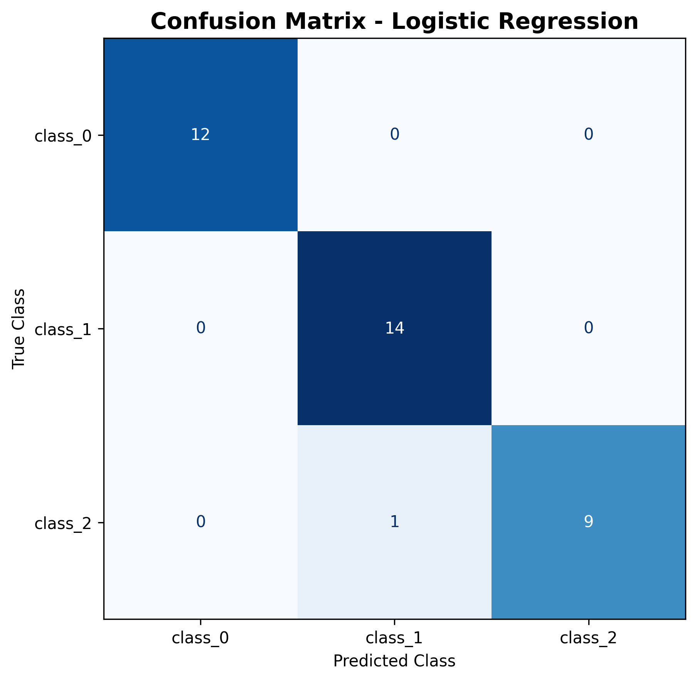
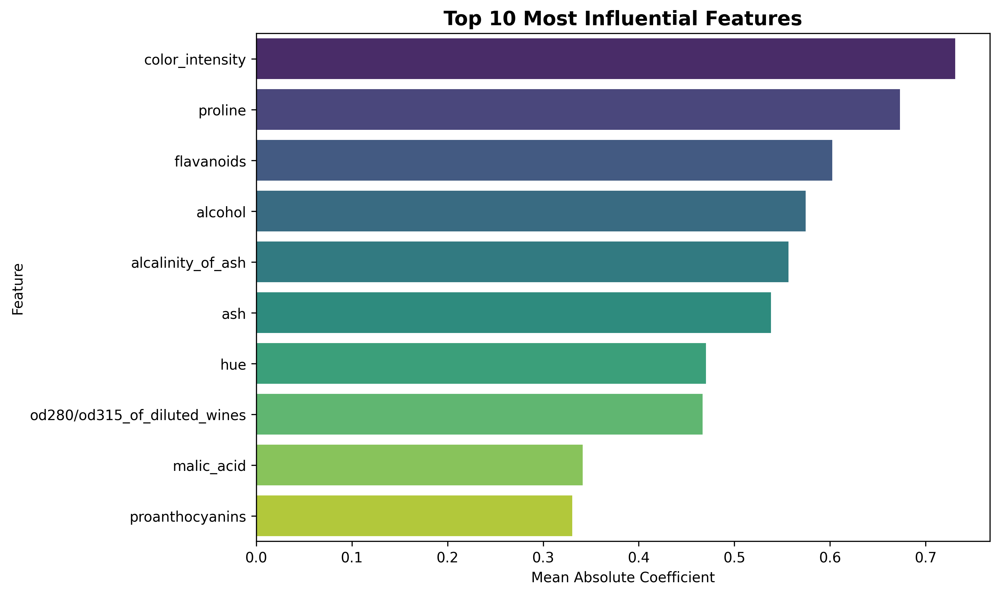

<div align="center">

# 🍷 Wine Classification & Model Comparison

A machine learning project that compares multiple classification algorithms on the Wine dataset and provides an interactive prediction application built with Streamlit.


</div>

## About the Project

This project classifies wines into three different categories based on their chemical properties.

Four machine learning algorithms were trained and compared using stratified 5-fold cross-validation:

- Logistic Regression
- K-Nearest Neighbors
- Decision Tree
- Random Forest

The best-performing model was optimized, evaluated on an unseen test set, saved with Joblib, and integrated into an interactive Streamlit application.

## Project Features

- Exploratory data analysis
- Missing value and duplicate checks
- Class distribution visualization
- Correlation heatmap
- Stratified train-test split
- Multiple machine learning model comparison
- Feature scaling with pipelines
- Stratified 5-fold cross-validation
- Hyperparameter optimization with GridSearchCV
- Confusion matrix analysis
- Multiclass ROC curve analysis
- Feature importance visualization
- Saved machine learning model
- Interactive Streamlit prediction application
- Automated model tests

## Dataset

The project uses the Wine dataset provided by scikit-learn.

The dataset contains 178 samples, 13 numerical features, and 3 target classes.

| Property | Value |
|---|---:|
| Number of samples | 178 |
| Number of features | 13 |
| Number of classes | 3 |
| Missing values | 0 |
| Duplicate rows | 0 |

### Input Features

1. Alcohol
2. Malic acid
3. Ash
4. Alcalinity of ash
5. Magnesium
6. Total phenols
7. Flavanoids
8. Nonflavanoid phenols
9. Proanthocyanins
10. Color intensity
11. Hue
12. OD280/OD315 of diluted wines
13. Proline

## Project Workflow

1. Load and inspect the dataset
2. Perform exploratory data analysis
3. Check missing values and duplicate records
4. Visualize class distribution and feature correlations
5. Split the dataset using stratified sampling
6. Create preprocessing and model pipelines
7. Evaluate models with stratified cross-validation
8. Compare model performance
9. Optimize the best model using GridSearchCV
10. Evaluate the final model on the test set
11. Analyze the confusion matrix and ROC curves
12. Save the trained model
13. Test the saved model
14. Build an interactive Streamlit application

## Models and Preprocessing

| Model | Preprocessing |
|---|---|
| Logistic Regression | StandardScaler |
| K-Nearest Neighbors | StandardScaler |
| Decision Tree | No scaling |
| Random Forest | No scaling |

Feature scaling was included inside the model pipelines to prevent data leakage during cross-validation.

## Cross-Validation Results

The models were evaluated using stratified 5-fold cross-validation.

| Model | Accuracy | Precision | Recall | F1 Score |
|---|---:|---:|---:|---:|
| Logistic Regression | 0.9791 | 0.9789 | 0.9828 | 0.9796 |
| Random Forest | 0.9791 | 0.9785 | 0.9828 | 0.9789 |
| K-Nearest Neighbors | 0.9507 | 0.9526 | 0.9591 | 0.9512 |
| Decision Tree | 0.8808 | 0.8911 | 0.8830 | 0.8836 |

Logistic Regression achieved the highest cross-validation F1 score and was selected as the final model.

## Model Comparison



## Hyperparameter Optimization

The selected Logistic Regression model was optimized using GridSearchCV.

The best parameters were:

- `C`: 1
- `solver`: `lbfgs`

The best cross-validation F1 score was:

- `0.9796`

## Final Model Results

The optimized model was evaluated on the unseen test set.

| Metric | Score |
|---|---:|
| Accuracy | 0.9722 |
| Precision | 0.9778 |
| Recall | 0.9667 |
| F1 Score | 0.9710 |

The final model correctly classified 35 out of 36 test samples.

## Confusion Matrix



The confusion matrix shows that the model made only one incorrect prediction on the test set.

## Feature Influence



The Logistic Regression coefficients were analyzed to understand which chemical properties had the strongest influence on the model predictions.

Because the project is a multiclass classification problem, coefficient magnitudes were aggregated across the three classes.

## Streamlit Application

The project includes an interactive Streamlit application.

The application allows users to:

- Enter the 13 chemical properties of a wine
- Generate a wine class prediction
- View the prediction probabilities for all classes
- Display the results as a probability chart

## Project Structure

```text
wine-classification-project/
│
├── images/
│   ├── confusion_matrix.png
│   ├── feature_importance.png
│   └── model_comparison.png
│
├── app.py
├── requirements.txt
├── test_model.py
├── wine_classifier.joblib
├── wine_classification.ipynb
├── .gitignore
└── README.md
```

## Installation

Clone the repository:

```bash
git clone https://github.com/betulaltunyuva/wine-classification-project.git
```

Open the project directory:

```bash
cd wine-classification-project
```

Create a virtual environment:

```bash
python -m venv .venv
```

Activate the virtual environment on Windows:

```bash
.venv\Scripts\activate
```

Activate the virtual environment on macOS or Linux:

```bash
source .venv/bin/activate
```

Install the required packages:

```bash
pip install -r requirements.txt
```

## Running the Streamlit Application

Run the following command inside the project directory:

```bash
streamlit run app.py
```

The application will open in your browser.

## Running the Tests

Run the model tests with:

```bash
python test_model.py
```

Expected output:

```text
All model tests passed successfully.
```

## Jupyter Notebook

The complete machine learning workflow is available in:

```text
wine_classification.ipynb
```

The notebook contains:

- Dataset exploration
- Data visualizations
- Model training
- Cross-validation
- Model comparison
- Hyperparameter optimization
- Test set evaluation
- Confusion matrix
- ROC curve analysis
- Feature influence analysis
- Model saving

## Technologies Used

- Python
- Pandas
- NumPy
- Matplotlib
- Seaborn
- scikit-learn
- Joblib
- Streamlit
- Jupyter Notebook
- Google Colab

## Notes

- The dataset is loaded directly from scikit-learn.
- A fixed `random_state` is used for reproducibility.
- Stratified splitting preserves class distributions.
- Feature scaling is applied inside pipelines to prevent data leakage.
- The saved model contains both preprocessing and classification steps.

## Future Improvements

- Deploy the Streamlit application
- Add automated testing with GitHub Actions
- Add additional classification algorithms
- Improve hyperparameter search
- Add model explainability with SHAP
- Allow batch predictions using CSV files

## Author

**Betül Altunyuva**

GitHub: [betulaltunyuva](https://github.com/betulaltunyuva)

## License

This project is intended for educational and portfolio purposes.
